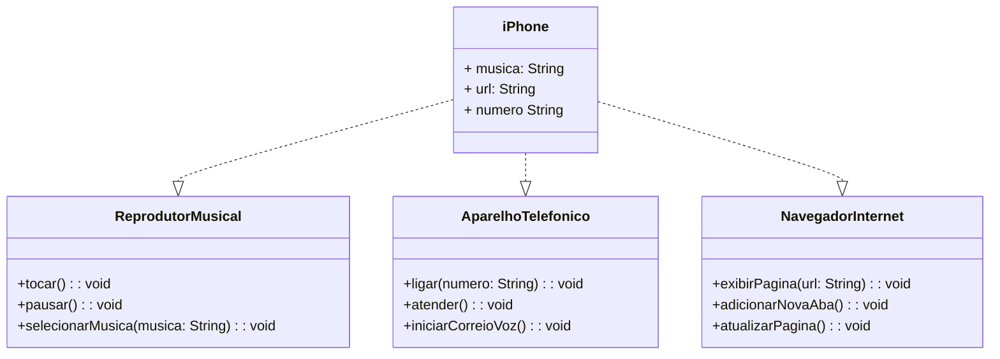

# Desafio POO - Modelando um iPhone com Java

Projeto desenvolvido para o Desafio de Programação Orientada a Objetos do bootcamp de Java da DIO. O objetivo foi modelar e implementar as funcionalidades de um iPhone, aplicando conceitos de Abstração, Encapsulação, Polimorfismo e o uso de Interfaces.

---

## Diagrama de classe 

